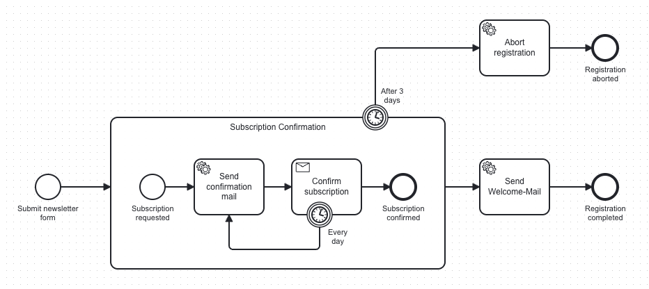

> 🥨 **easy-zeebe is a template — clone it, learn from it, adapt it.**
> It shows how to orchestrate business processes with Zeebe and Spring Boot while applying the practices
> that keep automation projects clean, testable, and maintainable as they grow.

# 🚀 What this repo demonstrates

At its core, easy-zeebe is a concrete example of **automating a business process with Zeebe** —
from BPMN model to working Spring Boot service. But it is more than that:
a curated collection of practices and patterns you can adopt in your own projects.

- **[Zeebe + Spring Boot integration](#hexagonal-architecture)** — hexagonal architecture with clean separation
  between business logic and engine adapters
- **[Type-safe process constants](#-bpmn-to-code-type-safe-process-constants)** — zero raw strings; everything
  generated from the BPMN via [bpmn-to-code](https://github.com/Miragon/bpmn-to-code)
- **[BPMN modelling conventions](#-bpmn-modelling-conventions)** — a styleguide covering naming, element IDs, and
  worker design
- **[Architectural Decision Records](#architectural-decision-records)** — key design choices documented in
  [MADR](https://adr.github.io/madr/) format
- **[AI skills & subagents](#-ai-powered-development)** — AI-powered workflows for scaffolding, testing, and
  reviewing Zeebe processes

## 💡 Automation in Action

This repository implements a **newsletter subscription process** —
a realistic workflow covering service tasks, message correlation, timers, and error handling:



## 🔧 Getting Started

1. **Start the Zeebe Stack**

   Navigate to the `/stack` directory and start the infrastructure using Docker Compose:

   ```bash
   docker-compose up -d
   ```

2. **Run the Application**

   The project is a **Gradle**-based Spring service. The easiest way is via **IntelliJ**: open the project, go to the
   `/run` folder, and use the provided run configurations. Or run from the terminal:

   ```bash
   ./gradlew :services:example-service:bootRun
   ```

3. **Interact with the API**

   Use the requests in the **`/bruno`** folder to interact with the service.
   Download Bruno at [usebruno.com](https://www.usebruno.com/).

4. **Monitor Processes**

   Access Camunda Operate at `http://localhost:8080/operate` (credentials: `demo` / `demo`) to watch processes run in
   real time.

## 📚 Repo Overview

```
/services   ← The example service: hexagonal Zeebe integration with newsletter subscription process
/stack      ← Docker Compose: Camunda Platform, PostgreSQL, Elasticsearch
/docs       ← BPMN styleguide, ADRs, and other project documentation
/bruno      ← Example API requests (Bruno collection)
/run        ← IntelliJ run configurations
```

## 🏗️ Architecture Suggestions

### Hexagonal Architecture

easy-zeebe structures the service as a **hexagonal (ports & adapters) architecture**.
Business logic lives in the domain and application layers with zero dependencies on the framework,
the database, or the process engine.
Everything infrastructure-related lives in adapters that plug into well-defined port interfaces.

```
domain/              ← Pure business logic, no framework dependencies
application/
  port/inbound/      ← Use-case interfaces (what the domain exposes)
  port/outbound/     ← Repository & process interfaces (what the domain needs)
  service/           ← Use-case implementations
adapter/
  inbound/zeebe/     ← Job workers (trigger use cases from Zeebe tasks)
  inbound/rest/      ← REST controllers
  outbound/zeebe/    ← Process adapter (starts processes, sends messages)
  outbound/db/       ← Database persistence adapter
  process/           ← Generated ProcessApi constants (bpmn-to-code)
```

Each layer is independently testable.
Swapping Zeebe for a different engine — or the database for a different store —
does not touch a single line of business logic.
This structure scales well as processes grow more complex,
and it makes the codebase predictable enough for AI-powered scaffolding tools to generate correct code on the first try.

The project also ships a **`common-architecture-test`** module that enforces these layer boundaries
and naming conventions at build time via [Konsist](https://docs.konsist.lemonappdev.com/).
Services extend its abstract test classes to get automatic checks wired into their regular test suite.
See [`services/common-architecture-test/README.md`](services/common-architecture-test/README.md) for details.

### Architectural Decision Records

Key architectural choices are documented as **Architecture Decision Records (ADRs)** using the
[MADR](https://adr.github.io/madr/) format.
Each ADR captures the context, the decision, and the reasoning behind it —
so future contributors understand *why* the code is structured the way it is, not just *how*.

- [`docs/adr/`](docs/adr/) — all recorded decisions
- The `/create-adr` skill generates new ADRs from a template, so adding one is as easy as describing the decision.

### ⚡ bpmn-to-code: Type-Safe Process Constants

One of the biggest sources of fragile automation code
is manually copy-pasting BPMN element IDs, message names, and task types.
A renamed element in your BPMN silently breaks your workers at runtime — not at compile time.

**[bpmn-to-code](https://github.com/Miragon/bpmn-to-code)** eliminates this problem entirely.
It generates a lightweight Kotlin (or Java) `ProcessApi` object directly from your BPMN model —
a single source of truth that all your workers, adapters, and tests can reference:

```kotlin
// Generated by bpmn-to-code — never written by hand
object NewsletterSubscriptionProcessApi {
    const val PROCESS_ID: String = "newsletter-subscription"

    object TaskTypes {
        const val NEWSLETTER_SEND_WELCOME_MAIL: String = "newsletter.sendWelcomeMail"
        const val NEWSLETTER_SEND_CONFIRMATION_MAIL: String = "newsletter.sendConfirmationMail"
        const val NEWSLETTER_ABORT_REGISTRATION: String = "newsletter.abortRegistration"
    }

    object Messages {
        const val MESSAGE_SUBSCRIPTION_CONFIRMED: String = "Message_SubscriptionConfirmed"
        const val MESSAGE_FORM_SUBMITTED: String = "Message_FormSubmitted"
    }

    object Variables {
        const val SUBSCRIPTION_ID: String = "subscriptionId"
    }
}
```

## 📐 BPMN Modelling Conventions

Consistent BPMN models lower the cognitive overhead for everyone reading, reviewing, or automating a process.
This repo ships a **BPMN styleguide** covering naming conventions, element IDs, message naming, and worker design —
patterns that keep diagrams readable and automation reliable.

The styleguide also serves as the contract for the `review-process` subagent,
which audits any process model against these conventions automatically.

- [`docs/bpmn-styleguide/README.md`](docs/bpmn-styleguide/README.md) — why a styleguide matters
- [`docs/bpmn-styleguide/styleguide.md`](docs/bpmn-styleguide/styleguide.md) — the full set of conventions

## 🤖 AI-Powered Development

easy-zeebe ships with a set of **skills** and **subagents** —
AI-powered workflows that handle the most repetitive parts of Zeebe development so you can focus on the actual business
logic.

All AI tooling is stored in the [`.claude/`](.claude/) folder and follows the
[Agent Skills](https://agentskills.io/home) open standard —
so the skills are not tied to any single AI agent and can run in any compatible environment.
This repo uses [Claude Code](https://claude.ai/code) as the exemplary agent.

### ⚡ Skills

Skills are reusable, single-turn AI workflows invoked with a slash command.
They follow the [Agent Skills](https://agentskills.io/home) open standard and are not limited to Claude Code —
any compatible agent can execute them.
Learn more in the [Claude Code Skills docs](https://code.claude.com/docs/en/skills).

**Zeebe skills** — cover the full Zeebe development lifecycle:

| Command                   | What it does                                                            |
|---------------------------|-------------------------------------------------------------------------|
| `/create-worker`          | Generate or update a `@JobWorker` class (inbound adapter)               |
| `/create-process-adapter` | Generate or update a process out-adapter (outbound adapter)             |
| `/automate-process`       | Scaffold workers + process adapter (combines the two `create-*` skills) |
| `/test-worker`            | Generate a unit test for a Zeebe job worker                             |
| `/test-process-adapter`   | Generate a unit test for a Zeebe process out-adapter                    |
| `/test-process`           | Generate process integration tests                                      |
| `/create-adr`             | Write a new Architecture Decision Record in `docs/adr/`                 |

**Supporting skills** — generic hexagonal-architecture helpers included as inspiration:
`/create-ticket`, `/create-rest-controller`, `/create-persistence-adapter`,
`/test-rest-adapter`, `/test-application-service`, `/test-persistence-adapter`

### 🔍 Subagents

Subagents run in their own isolated context with restricted tool access,
and are invoked automatically by the agent when relevant — or explicitly on request.
Learn more about [Claude Code Subagents](https://code.claude.com/docs/en/sub-agents).

| Subagent         | What it does                                                                                                                           |
|------------------|----------------------------------------------------------------------------------------------------------------------------------------|
| `review-process` | Audits a BPMN model and its glue-code for consistency and test coverage against the styleguide. Ask: *"review the newsletter process"* |

## 🤝 Contributing

Contributions of all kinds are welcome.
If you have ideas for improving the example process, the architecture patterns,
the BPMN styleguide, or the AI Agent skills —
please open an issue or a pull request on [GitHub](https://github.com/Miragon/easy-zeebe).

---

🥨 *Named "easy-zeebe" as a challenge. You decide if we won.*
