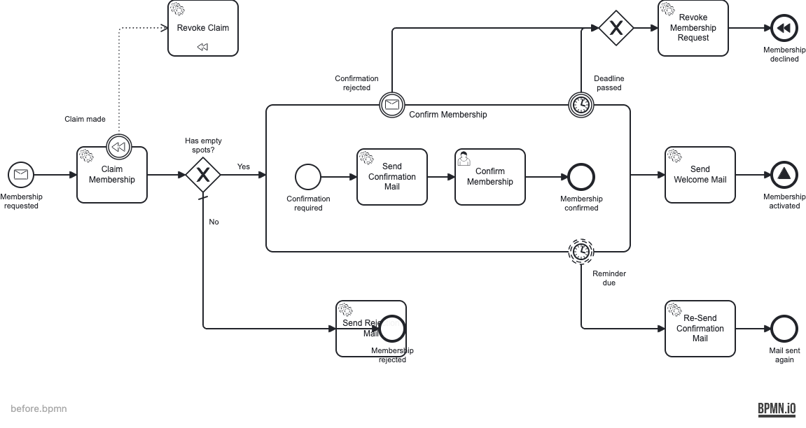
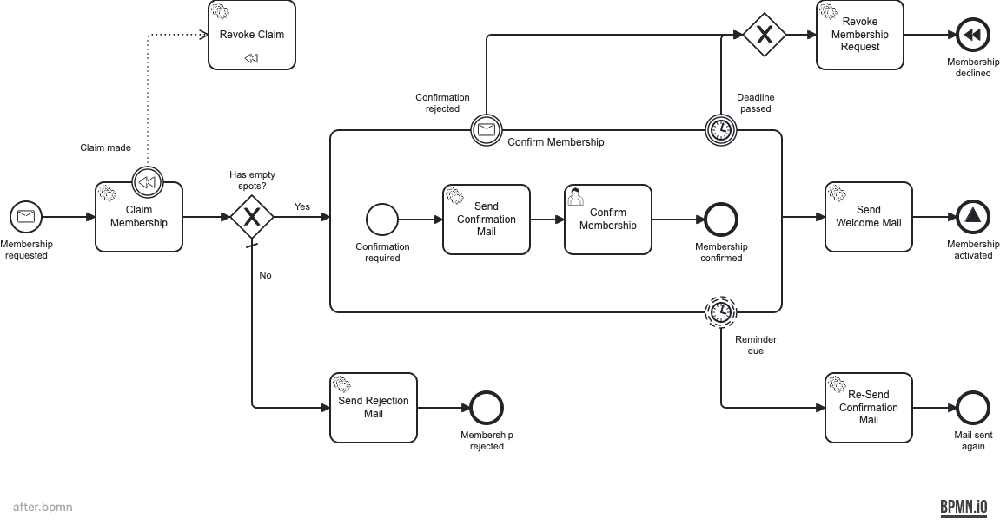

# Tier 2 — the AI edits the DI (a case Tier 1 can't fix)

Not every detected problem is an edge-routing problem. Here `Send Rejection Mail` was moved on
top of the `Membership rejected` end event — an **overlap**.

## Before ([`before.bpmn`](./before.bpmn))



The overlap is flagged by a **standard** bpmnlint rule (not one of our custom edge rules):

```
serviceTask_SendRejectionMail  error  Element overlaps with other element  no-overlapping-elements
endEvent_MembershipRejected    error  Element overlaps with other element  no-overlapping-elements
✖ 2 problems (2 errors, 0 warnings)                  # exit 1
```

The deterministic Tier-1 fixer **can't help** — it only re-routes edges:

```
$ npm --prefix tools run fix:bpmn -- before.bpmn
  0 flow(s) rerouted, 0 escalated
```

This is exactly why Tier 2 exists: the overlap is **deterministically detected**, but the
**repair** (move a shape, and its connected edges + label with it) is not an edge-routing
problem. The detection isn't the hard part — the fix is.

## After ([`after.bpmn`](./after.bpmn))

The agent nudges `Send Rejection Mail` clear of the end event; its incoming flow follows.



```
$ npx bpmnlint after.bpmn
                                                     # ✅ 0 problems — exit 0
```

Still DI-only — the process is unchanged. (The same Tier-2 path handles a missing shape
(`no-bpmndi`) or a layout that is _valid but reads badly_, which no rule flags at all.)
