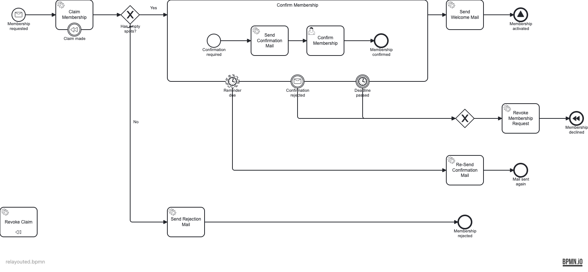

# Tier 3 — full auto-layout (the escape hatch)

Throws the diagram interchange away and regenerates everything from the semantic model. Input:
[`probe-messy`](../../probes/probe-messy/).

```bash
npm --prefix tools run auto-layout:bpmn -- docs/bpmn-quality-gates/probes/probe-messy/probe-messy.bpmn --write
```

## After ([`relayouted.bpmn`](./relayouted.bpmn))

`bpmn-auto-layout` produces a valid left-to-right orthogonal layout:



It _is_ clean and orthogonal — but this is the **escape hatch, not a free lunch**:

- **the hand-tuned layout is gone** — the happy path no longer runs prominently across the
  middle, the boundary events are no longer on the sub-process border, etc.;
- **`Revoke Claim` floats disconnected** and the compensation **association is dropped**, so it
  still lints **one error**:

```
Association_ClaimCompensation  error  Element is missing bpmndi  no-bpmndi
✖ 1 problem (1 error, 0 warnings)                    # exit 1
```

bpmn-auto-layout does not lay out **associations, groups, or message flows** (and lays out only
the first pool of a collaboration, with sub-processes collapsed). Use it only for a model with
no diagram interchange at all, or as a last resort — then fix the dropped bits in Tier 2.
