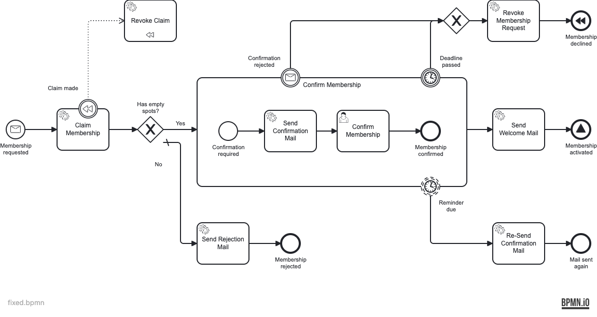

# Tier 1 — deterministic reroute (ManhattanLayout)

The surgical, **layout-preserving** fix. Input: [`probe-messy`](../../probes/probe-messy/) — the
`No` flow re-routed straight through two unrelated elements.

```bash
npm --prefix tools run fix:bpmn -- docs/bpmn-quality-gates/probes/probe-messy/probe-messy.bpmn --write
```

## Before

`probe-messy` ([see it](../../probes/probe-messy/)) — the flow slashes through `Send Confirmation Mail` and `Membership rejected`:

```
Flow_no_spots  error  Sequence flow is routed through element <serviceTask_SendConfirmationMail>  local/flow-through-element
Flow_no_spots  error  Sequence flow is routed through element <endEvent_MembershipRejected>       local/flow-through-element
✖ 2 problems (2 errors, 0 warnings)                  # exit 1
```

## After ([`fixed.bpmn`](./fixed.bpmn))

bpmn.io's `ManhattanLayout` recomputes a clean orthogonal route for **just `Flow_no_spots`** —
`(450,355) (800,355) (800,550) (540,550)` → `(475,355) (508,355) (508,550) (540,550)`. **No shape
moved.**



```
$ npx bpmnlint fixed.bpmn
                                                     # ✅ 0 problems — exit 0
```

Deterministic, reproducible, and semantics-safe (only the edge's waypoints changed).
`probe-crossing` is fixed the same way (the dip is straightened back out).
