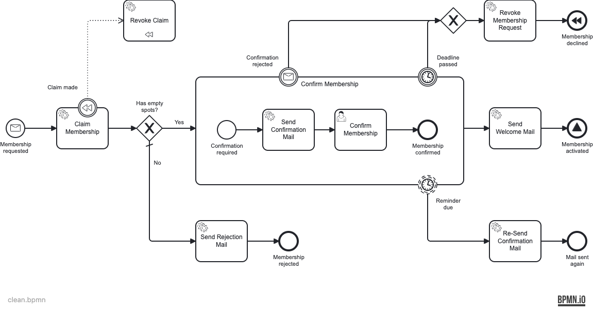

# clean — control probe

An exact copy of the production membership model
(`services/example-service/src/main/resources/bpmn/membership.bpmn`), which lints **0 problems**.
The control: both safety nets must pass it — if it ever logs something, a rule has gained a
false positive.



## Previous state

Passes. `npx bpmnlint` reports nothing (exit 0).

## Fixed state — what is logged

Unchanged — still **0 problems** (exit 0). A control probe has no defect to catch; if it ever
starts logging something, a rule has gained a false positive.

```
$ npx bpmnlint clean.bpmn
                                                   # (no output) — exit 0
```

## Reproduce

```bash
npx bpmnlint docs/bpmn-quality-gates/probes/clean/clean.bpmn
```
