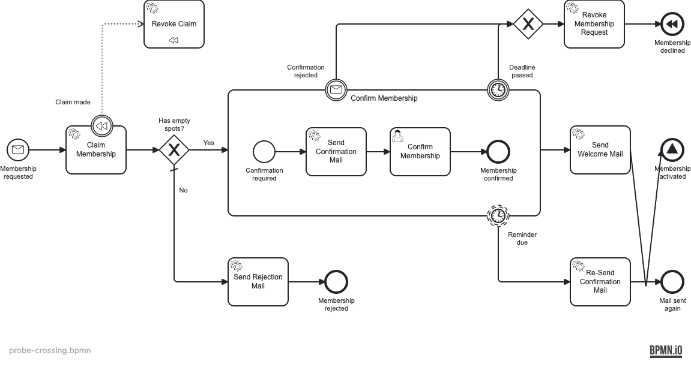

# probe-crossing

The **Welcome → Activated** flow was re-routed to dip down and cross the independent
**Re-Send → Mail sent again** flow. No shape moved; two flow paths simply intersect.



## Previous state (the blind spot)

`npx bpmnlint` reported **nothing** and exited 0 — same reason as `probe-messy`: the shipped
rules do not look at edge geometry, so two crossing flows pass.

```
$ npx bpmnlint probe-crossing.bpmn
                                                   # (no output) — exit 0
```

## Fixed state — what is now logged as error

With `local/no-crossing-flows` (error) in place:

```
  Flow_welcome_to_activated  error  Sequence flow crosses sequence flow <Flow_reSend_to_end>  local/no-crossing-flows
✖ 1 problem (1 error, 0 warnings)                  # exit 1
```

All geometry rules are **errors** here, consistent with `no-overlapping-elements` (which we
also bumped from bpmnlint's default `warn` to `error`): a crossing is treated as a defect to
fix. If a crossing is genuinely unavoidable in a dense diagram, suppress that one occurrence
with a `bpmnlint-disable` directive rather than relaxing the rule globally.

## Reproduce

```bash
npx bpmnlint docs/bpmn-quality-gates/probes/probe-crossing/probe-crossing.bpmn
```
