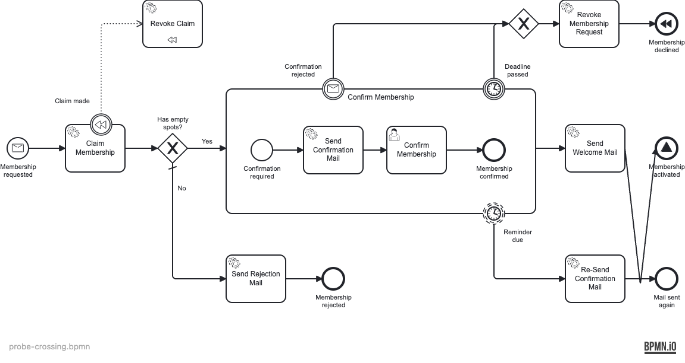

# probe-crossing

The **Welcome → Activated** flow was re-routed to dip down and cross the independent
**Re-Send → Mail sent again** flow. No shape moved; two flow paths simply intersect.



## Previous state (the blind spot)

`npx bpmnlint` reported **nothing** and exited 0 — same reason as `probe-messy`: the shipped
rules do not look at edge geometry, so two crossing flows pass.

```
$ npx bpmnlint probe-crossing.bpmn
                                                   # (no output) — exit 0
```

## Fixed state — what is now logged as warning

With `@miragon/rules/flow-crossing` (warning) in place:

```
  flow_welcomeToActivated  warning  Sequence flow crosses sequence flow <flow_reSendToEnd>  @miragon/rules/flow-crossing
✖ 1 problem (0 errors, 1 warning)                  # advisory — exit 0
```

The edge-geometry rules report at **warning** level under the `recommended-for-automation`
preset — a crossing is surfaced for the author but does not fail the gate. (`no-overlapping-elements`,
by contrast, we bumped from bpmnlint's default `warn` to `error`.) If a crossing is genuinely
unavoidable in a dense diagram, suppress that one occurrence with a `bpmnlint-disable` directive.

## Reproduce

```bash
npx bpmnlint docs/bpmn-quality-gates/probes/probe-crossing/probe-crossing.bpmn
```
