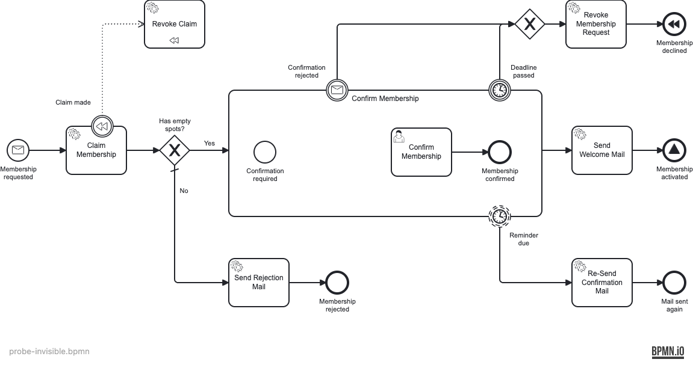

# probe-invisible

The `BPMNShape` for the **Send Confirmation Mail** task was deleted. The task still exists in
the XML and still executes — it just never renders ("invisible element"). In the picture the
_Confirm Membership_ sub-process has a gap where the task should be: the start event has no
outgoing arrow and the user task no incoming one.



## Previous state

This was **never a blind spot.** bpmnlint's shipped `no-bpmndi` rule (in `bpmnlint:recommended`,
error) flags any semantic element with no shape, so even before the custom layout rules it was
caught:

```
  serviceTask_SendConfirmationMail  error  Element is missing bpmndi  no-bpmndi
✖ 1 problem (1 error, 0 warnings)                  # exit 1
```

## Fixed state — what is logged as error

Unchanged — the custom layout rules don't touch this case (it is a missing _shape_, not bad
edge geometry):

```
  serviceTask_SendConfirmationMail  error  Element is missing bpmndi  no-bpmndi
✖ 1 problem (1 error, 0 warnings)                  # exit 1
```

## Reproduce

```bash
npx bpmnlint docs/bpmn-quality-gates/probes/probe-invisible/probe-invisible.bpmn
```
