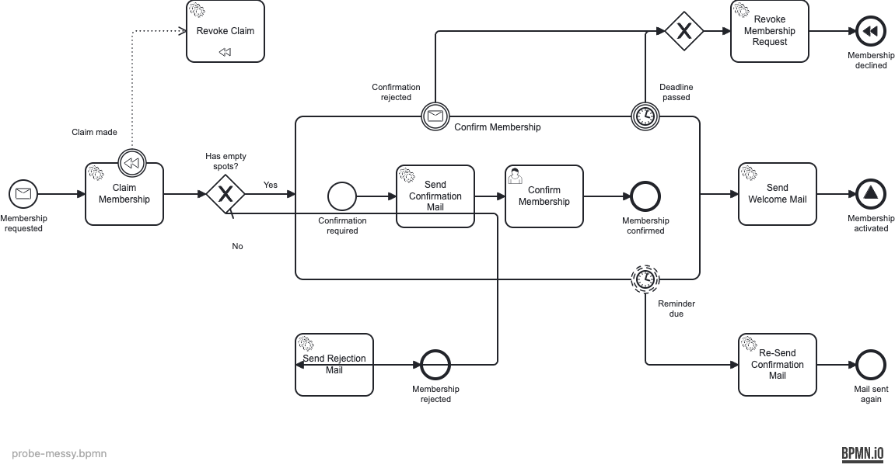

# probe-messy

The **No** sequence flow was re-routed straight through the _Send Confirmation Mail_ task and
the _Membership rejected_ end event. **No shape was moved** — every box is where it belongs;
only the flow's waypoints are wrong.



## Previous state (the blind spot)

`npx bpmnlint` reported **nothing** and exited 0. bpmnlint's shipped DI rules only compare
**shape-vs-shape** bounds; they never inspect edge waypoints, so a flow slashing through a task
passes untouched. This is the gap that motivated the custom rules.

```
$ npx bpmnlint probe-messy.bpmn
                                                   # (no output) — exit 0
```

## Fixed state — what is now logged as error

With `local/flow-through-element` (error) in place, both penetrated elements are reported:

```
  Flow_no_spots  error  Sequence flow is routed through element <serviceTask_SendConfirmationMail>  local/flow-through-element
  Flow_no_spots  error  Sequence flow is routed through element <endEvent_MembershipRejected>       local/flow-through-element
✖ 2 problems (2 errors, 0 warnings)                # exit 1
```

## Reproduce

```bash
npx bpmnlint docs/bpmn-quality-gates/probes/probe-messy/probe-messy.bpmn
```
